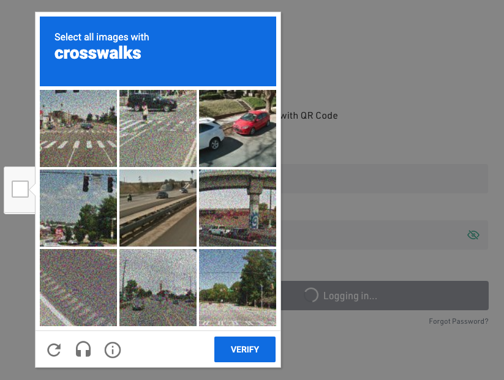

 

    

 

Captchains
---

Create Captchas on demand backed by Chainlink API calls and smart contracts on the BSC Testnet.

BSC security tool.

Captchains is a platform for validating site visitors or user actions by requiring users to validate they are human by the ability to research the answer to an API-driven question - rather than an image.

<b>Note this project is a hackathon proof of concept and would require additional work in order to be production ready</b>

### Problem

How many Captchas have you filled out that look like this?

Captchains enables customers to provision their own captchas, with the resiliency and auditability of blockchain.

Each Captcha:
1. Requests the user to identify a keyword based on an image (not autoselect of images).
2. Requires the user state the latest price of ethereum, but this could be in theory any API-call based question that requires research in order to answer.

The captcha is also self-driving, operating based on the gas fees of the network in order to process the authentication. This makes Captchain work well with lower-cost networks such as Polygon/BSC.

### How it works
1. API-call driven captchas that have character, or have dynamic questions based on the app you're visiting.
2. Have an auditable history.
3. Create a platform managing captchas across many different apps, all for the cost of gas on low cost Polygon chains.
4. Save the result of the c

### Technologies used
* Chainlink Services:
* Filecoin storage and tools:
* Covalent API calls: Price fetch and human validation of the price.
* Moralis - Captcha storage and lookup per user (based on active metamask address)

### How to run

Define the following environment variables:
<pre>
    REACT_APP_MORALIS_ID={YOUR_MORALIS_APP_ID} # Moralis app id 
    REACT_APP_MORALIS_SERVER={YOUR_MORALIS_SERVER_URL} # Moralis server url
    REACT_APP_COVALENT_KEY={YOUR COVALENT KEY} # This is passed in as an arg to the chainlink contract. Covalent then issues an API call on each captcha to update the record (Ethereum) price which is used for authentication.
</pre>

App is currently configured to run against Polygon / Mumbai using Moralis as the Web3 RPC client and storage provider.

`yarn; yarn start`

### Changing networks (local deployment)
1. Update job/oracle/fee in `Captchain.sol` to new node provider.
2. Update ACTIVE_CHAIN_ID in `constants.js` to the chain id of your target network.
3. Recompile `Captchain.sol` and add the new code to `metadata.json`.
4. Update moralis credentials above to new target server.

### Updating the Captchain smart contract

Make any changes to `Captchain.sol` in the `contracts` directory.

`cd contracts; yarn; npx hardhat compile`

If unable to estimate gas when completing a captcha, check that you're on a supported network - BSC testnet (default) or Polygon Mumbai, followed by confirming that your contract has been successfully funded; a gas estimation fee can result from calling loadValue on the contract without any LINK balance on it.

### Future work
* Production deployment.
* Custom branding of the Captcha widget.
* Export of the Captcha widget to other apps as a react component as a per-usage model.
* Ability to configure the API-call based authentication mechanism.

### Useful links
* https://web3.storage/
* https://hardhat.org/tutorial/creating-a-new-hardhat-project.html
* https://testnet.binance.org/faucet-smart

